# 📄 System Planning in Jira

## Work Breakdown: Epics, User Stories and Tasks

The implementation of TechCup's identified requirements is broken down as follows:

### 1. Epic:

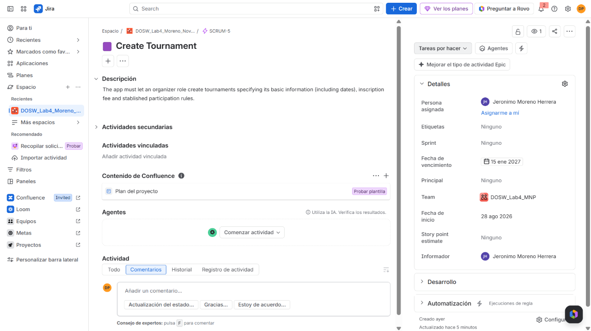

### 2. User Stories:

#### User Story 1️⃣

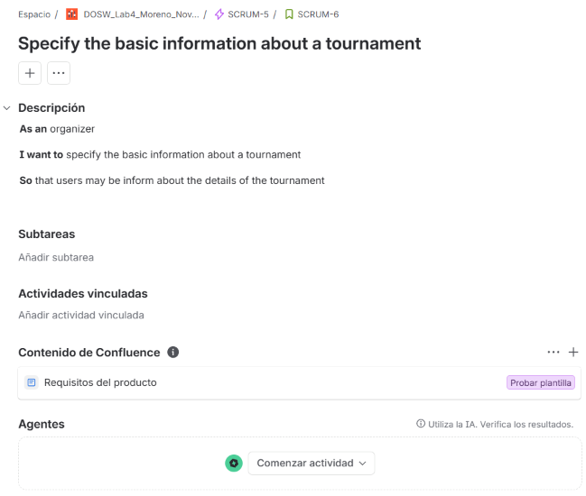

#### User Story 2️⃣

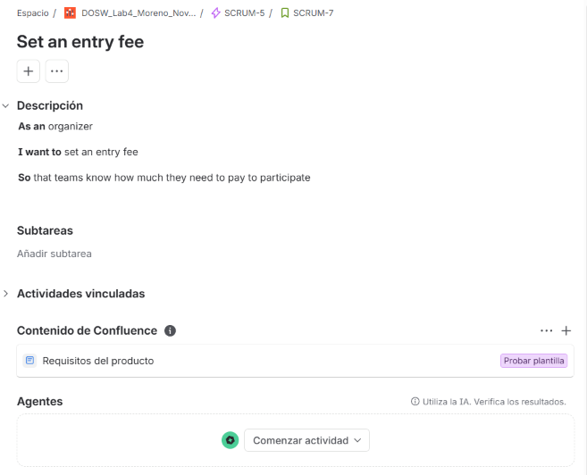

#### User Story 3️⃣

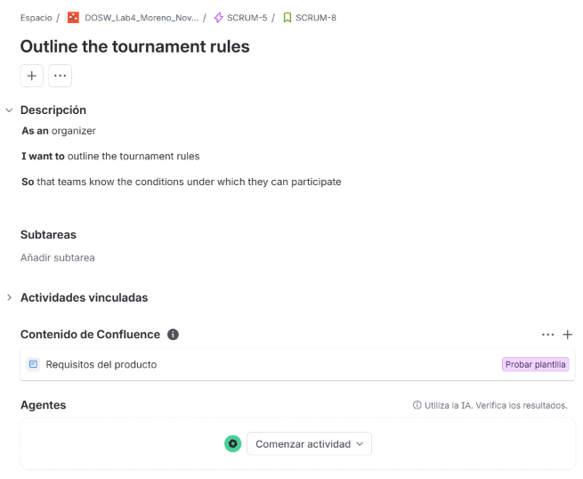

#### User Story 4️⃣

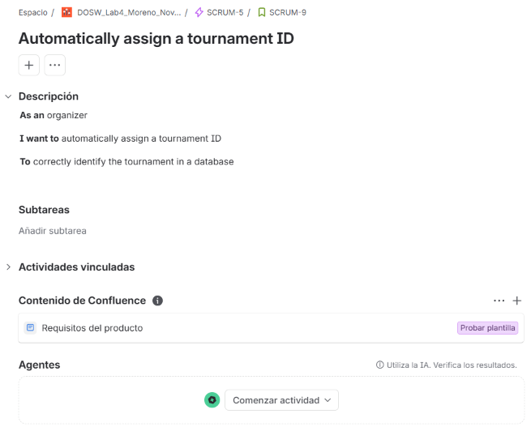

### 3. Tasks:

#### User Story 1️⃣

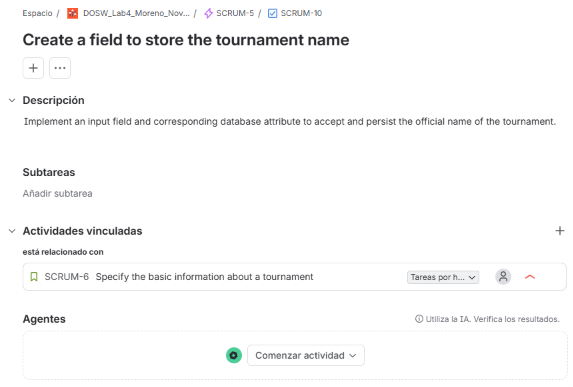

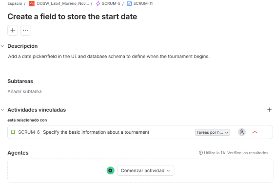

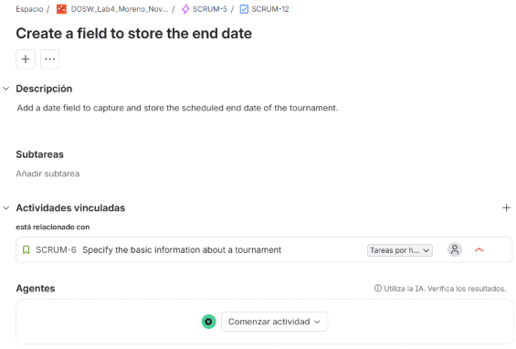

#### User Story 2️⃣

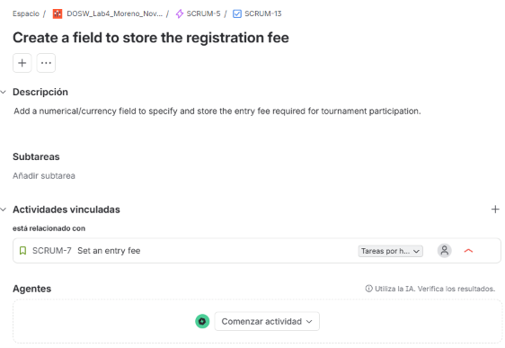

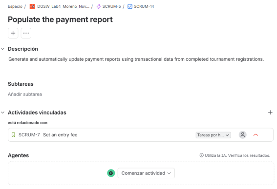

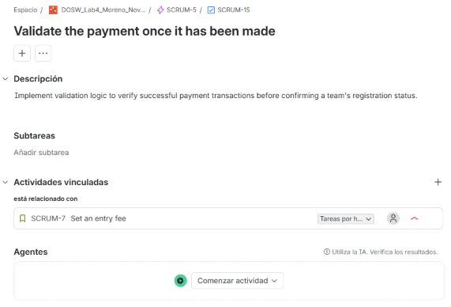

#### User Story 3️⃣

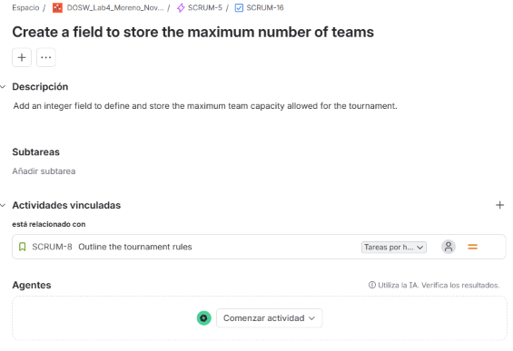

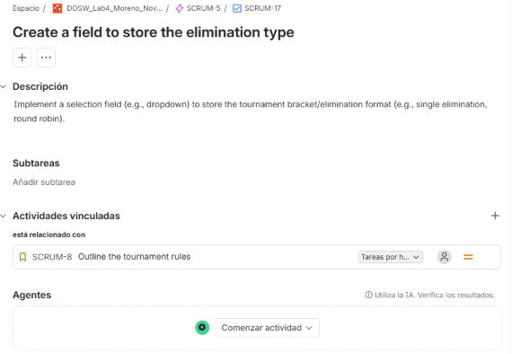

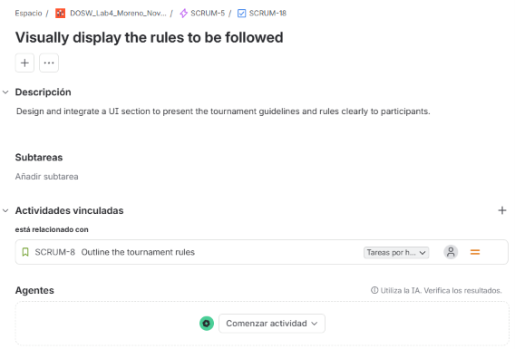

#### User Story 4️⃣

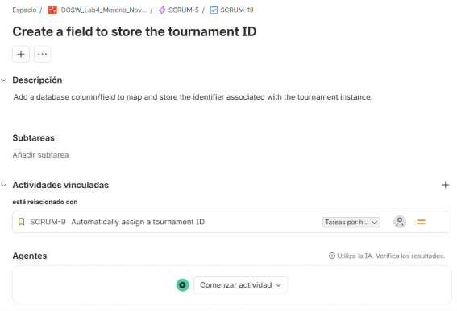

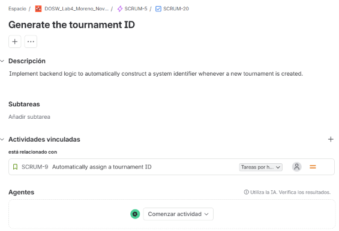

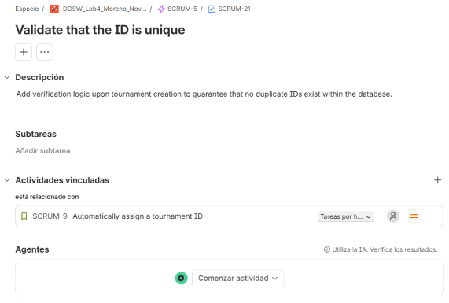

### 4. Schedule 🗓️:

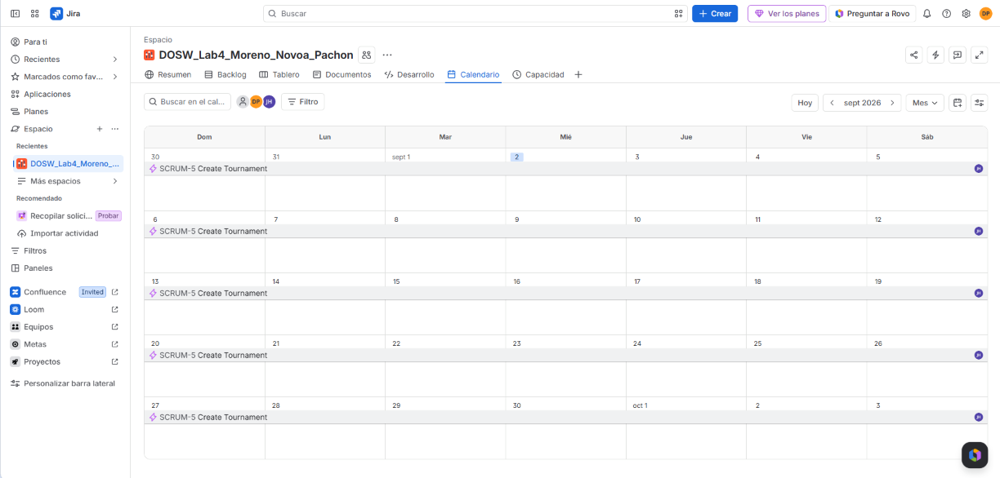

### 5. Sprint Backlog:

## Sprint Backlog

### User Story 1 - Specify the basic information of a tournament

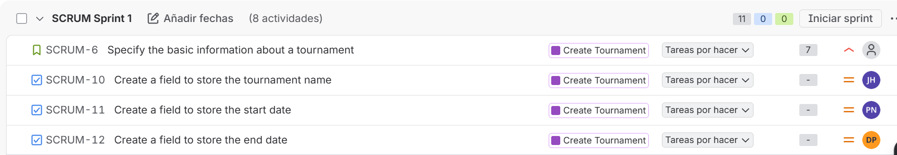

We selected User Story 1 for Sprint 1 because it is a fundamental part of the tournament creation process. The tournament needs basic information such as its name, start date, and end date before users can properly identify and understand the tournament.

The tasks were distributed among the three team members so that everyone participates in the development of this user story. Aleja is responsible for creating the field to store the tournament name, Jerónimo is responsible for the tournament start date, and Valeria is responsible for the tournament end date.

This distribution allows the work to be divided evenly and gives each team member a specific and manageable task.

---

### User Story 3 - Define the tournament rules

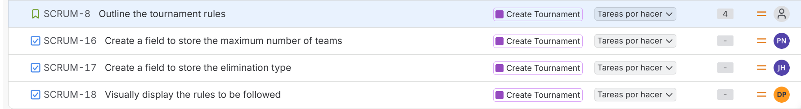

We selected User Story 3 for Sprint 1 because defining the tournament rules is also an important part of creating a tournament. These rules allow the organizer to establish important aspects such as the maximum number of teams and the elimination format.

The tasks were distributed among the three team members so that everyone also participates in this user story. Aleja is responsible for creating the field to store the maximum number of teams, Jerónimo is responsible for creating the field to store the elimination type, and Valeria is responsible for displaying the tournament rules visually.

This distribution was chosen so that each team member has two tasks in total and contributes to both User Story 1 and User Story 3. This helps maintain a balanced workload and encourages collaboration among the team members.